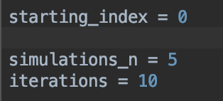

# TRAPP City-Scale Alpha Beta Testing
TRAPP framework for Traffic Reconfiguration via Adaptive Participatory Planning
<!--The user guide for the SEAMS 2019 reviewers is available at https://www4.in.tum.de/~gerostat/SEAMS19_user_guide.zip.-->

## Read about TRAPP
* [Pre-print](http://wwwbroy.in.tum.de/~gerostat/pubs/SEAMS19-EPOS-SUMO.pdf) of TRAPP publication at the [14th Symposium on Software Engineering for Adaptive and Self-Managing Systems 2019](https://conf.researchr.org/home/seams-2019)

## What is being tested through exp_beta.py?
* 

## Installation and Set Up

1. Follow the steps for downloading [TRAPP](https://github.com/iliasger/TRAPP/tree/experiments#trapp), which can be found in the general README.

1. Once TRAPP is correctly installed, create a `app/Config.py` file using `app/Config_TEMPLATE.py` as a guide. Copy `Config_TEMPLATE.py` into `app/Config.py` and fill in any information under the `#TODO` label.

1. Creating a new map for the desired city.

	* Using the command line, maneuver to the tools folder found within SUMO and use the following command to open OSM Web Wizard : `python osmWebWizard.py`
	* Once in OSM Web Wizard: enter the coordinates of the desired city, configure the shape of the box, and hit the generate simulation button.
	* The associated files are saved in a folder under tools with the format YYYY-MM-DD-HH-MM-SS and the only files necessary to run the new city are osm.net.xml, osm.sumo.cfg, and osm.view.xml all of which can renamed.
	* To clean up the map, use the command `netedit`, open the .net.xml file of the map, and delete any unnecessary roads.
	* To remove all edges except passenger edges, maneuver to the folder that holds the map and use the command `netconvert -s “app/map/Example.net.xml” -o “app/map/Example.net.xml” --keep-edges.by-vclass “passenger” --tls.guess-signals --tls.discard-simple --tls.join`
	* In the Config.py file, set `sumoConfig` equal to the path containing the `sumo.cfg` file and set `sumoNet` equal to the path containing the `.net.xml` file.
	* Now the new map should be able to run in TRAPP.

1. Use the Distracting by ZIP code Step-by-Step Instructions found in the general README.md for more accurate origin selection. 

	After `app/map/CityNameDistricts/CityName_districts.xml` is created keep the *use_districts* parameter as *True* and the *do_gridding* as *False* in `app/Config.py`. 

1. After doing the gridding for the map, have to create a baseline for the cars which can be done through running `exp_baseline_overheads.py` 
	* There are 3 things that can be changed in `exp_baseline_overheads.py` file, which  are shown below 
 	
 		
 	
 		* *starting_index*: the iteration number that the baseline will start on, this is useful if some baselines have already been run and you want to run more
 		* *simulations_n*: the number of simulations that are run in parallel
 		* *iterations*: the number of times the simulation is run

 	* In running the test, opted for a total of 50 baselines runs for each city, so running 5 parallel over 10 iterations
 	* For running each baseline, must change the number of cars needed for that city in the `app/Config.py` file. 
 		* In order to figure out the number of cars needed to be ran for  each city the equation below can be used, please adjust calculations as needed: 
 		
            * `Total # of cars = ((total population of city * (percent of people who idividually drive to work/100)) / 6 )`
 		
                * The number six is derived from the goal of capturing the height of rush hour in the mornings, which usually occurs from 6:30- 9:30am, which is 3 hours. Also when running the simulations decided on 1800 seconds (half hour) as the simulation time as the average commute time in the US is around 25 minutes. There are 6 half hour time period within  3 hours, which correlate to only having 1/6 the cars on the road.
 	* The results of the baseline will appear as `results/baseline/#ofCarsUsed`, with #ofCarsUsed being the number representing the *totalCarCounter* parameter in the `app/Config.py` 
 	* Before entering `python exp_baseline_overheads.py` in the terminal to run the simulation double check that:
 		* The `app/map/CityNameDistricts/CityName_districts.xml` file has been created for that city
 		* The *city_name* parameter at the bottom of the `app/Config.py` should correlate to city testing 
 		* The *totalCarCounter* parameter in the  `app/Config.py` is correct for the correlating city
 		* The *debug* parameter is set *False* for faster processing speeds and *do_gridding*, *log_overheads*, *log_utilizations*, *do_adaptation*, *do_EPOS_planning*, *multiple_car_routes* should be *False*
 		* Also make sure that *do_baseline_run* parameter is set to *True* 

 	* Some tips: 
 		* Start with *iteration* parameter set to 2 and do a test run with debug on
 		* Check the `results/baseline/#ofCarsUsed/` folder to see if the results are appearing and correct
 			* Should see 10 csv files representing each time the simulation ran
 		* If  it is working correctly instead of restarting the baseline, set *starting_index* parameter to 9 and *iteration* parameter to 8 
 		* Keep the `app/Config.py`file for each city under a different name, but still within the app folder 
 			* This is so that you do not have to fill out the TODO in the `app/Config.py` every time and helps avoid mixing data

1. Once the baseline is run for that current city, a new `app/entity/CarHistory.py` file has to be created that correlates to the city and number of cars being run in the city
	* In order to create the `app/entity/CarHistory.py` file run it through the jupyter notebook located in TRAPP called `notebooks/EPOS Cost calculation.ipynb`
		* Open Jupyter notebook by entering `jupyter notebook` into a new terminal window
			* Once Jupyter notebook pops up in a browser, navigate to the note book called `notebooks/EPOS Cost calculation.ipynb`
		* In the notebook change the path in the code (which can be seen below) to correlate to where the overheads are held on your computer or server (the path should be similar to what is pictured below) 
	
			~~~~
			agents = {}
			for i in range(49):
    				data = get_data_from_file("/Users/taylorpothast/TRAPP/
    					results/baseline/13000/overhead_" + str(i) + ".csv")
    
			~~~~
		* Run the Jupyter notebook by pressing the button that says run on the tool bar 
		* Due to configuration set up, in order to use the new car history data must copy and paste the results of the Jupyter notebook to the `app/entity/CarHistory.py` file 
			* For records purposed save each cities `app/entity/CarHistory.py` information in `app/entity/Differing_Car_History` folder by copying and pasting the information in a new file named as `app/entity/Differing_Car_History/nameOfCity_numberOfCarsRan_Car_History.py`
				* Then once you have the new file saved in the`app/entity/Differing_Car_History` folder, then can paste the information for the correlating city and number of cars in `app/entity/CarHistory.py` file 

1. Repeat steps 3-6 for each desired city.

## Running the Experiment 
For these steps it is assumed that the appropriate district files have been created for the city being used, the baseline is correctly set up

1. Once the `app/entity/CarHistory.py` is created for that city, double check for the things listed below before running  `exp__beta.py`: 
	* Even though the `exp__beta.py` automatically overrides many of the parameters in the `app/Config.py` file, there are still a few things to double check in the `app/Config.py`:
		* *debug* parameter can be either *False* or *True* , but when running with a high number of cars it should be set to *False* for efficiency purposes
		* As this will be the first time running EPOS double check that the *epos_jar_path* is correct
		* *EPOS_memory* will most likely have to be increased if you are running anything around or over 1000 cars, as the total number of cars able to run in EPOS is dependent on both the memory available and how much time is available to run the simulations

			* In order to run EPOS with 10000 cars the *EPOS_memory* has to be increased from 4GB to 12GB 
			* Adjust accordingly to the number of cars and how much your machine or server memory can hold
		* Check to make sure the *sumoConfig* and *sumoNet* correlate to the city being tested
		* Set *totalCarCounter* as the number of cars want to run in the test and make sure again the *totalCarCounter* number correlates to city being tested
		* Set *planning_period*, *planning_steps*, and *planning_step_horizon* to what is seen below: 

		~~~~
			simulation_horizon = 1800
			planning_period = 100000
			planning_step_horizon = 1800
    	
   		~~~~
    	* With 1800 representing half hour of time and since not trying to have EPOS replan during the simualtion set the planning_period to a very high number exceeding the *simulation_horizon* 
		
	* Once the Config is all set, go to `exp_beta.py` and fill out the things marked TODO which include: 
		* Configuring the *resultsFolder* parameter to the name of the city testing
	* Then run `exp__beta.py` by entering `python exp__beta.py` into terminal

1. The results of `exp_beta.py` can be found under  `results\resultsFolder_name_in_config\beta\`
	* If testing alpha, will be found under `results\resultsFolder_name_in_config\alpha\`
	* 3 types of csv files can be found within the beta folder:
		* 2 folders can be found in the `results\resultsFolder_name_in_config\beta` folder:  
			* local: this folder holds a csv file for the local cost for each run of the simulation 
			* global: this folder holds a csv file for the local cost for each run of the simulation 
		* The other files found in the  `results\resultsFolder_name_in_config\beta` folder are the overhead files for each run of the simualation
		* The naming convention for each file is: 
			* `local_a#_b#_s#` for local cost files, `global_a#_b#_s#` for global cost files and `a#_b#_s#` for the overhead files ,
     			* a represents alpha and the # for that run
     			* b represents beta and the # for that run
     			* s represents seed and the # for that run

1. Can talk about what data each `exp_beta.py` and `exp_alpha.py` collects from the plan 

1. the data collected where used to create 6 distinct graphs

1. talk about the jupyter notebooks that can be used to recreate teh graphs used 

## Running exp_alpha.py
1. To run `exp__alpha.py` follow the same steps used for `exp_beta.py`
	* The taz file and baseline runs do not need to be redone for alpha
	* If running both `exp_beta.py` and `exp_alpha.py` suggest having the name for the *resultsFolder* in the `exp_alpha.py` and `exp_beta.py` be the same name for each city

## Troubleshooting

If you need help in extending TRAPP or adding new cities and their district in the experiment, feel free to contact us:

* Brionna Davis, <brionna.e.davis@vanderbilt.edu>
* Grace Jennings, <grace.e.jennings@vanderbilt.edu>
* Taylor Pothast, <taylor.m.pothast@vanderbilt.edu>
* Ilias Gerostathopoulos <gerostat@in.tum.de>
