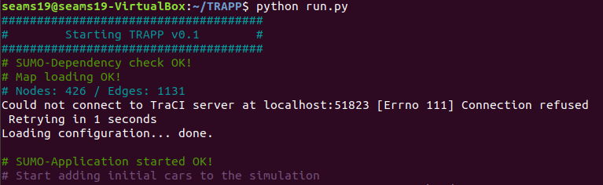
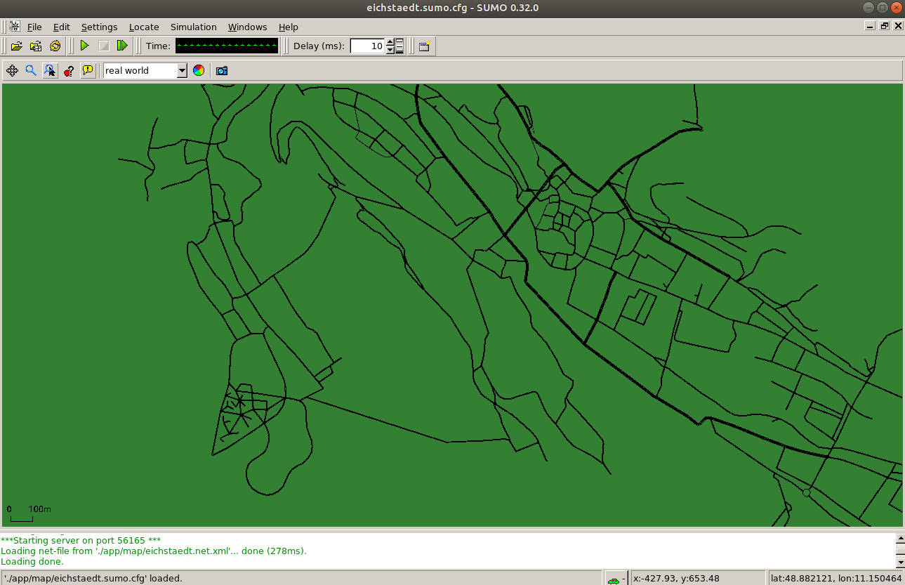
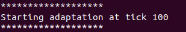
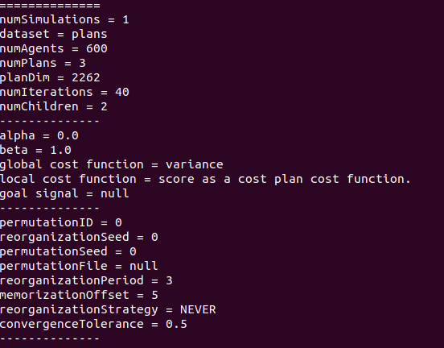
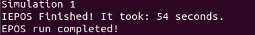
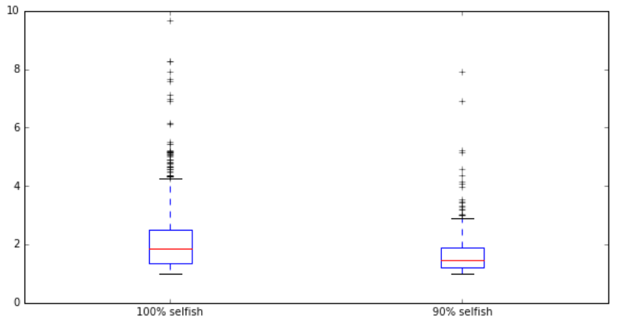

# TRAPP
TRAPP framework for Traffic Reconfiguration via Adaptive Participatory Planning
<!--The user guide for the SEAMS 2019 reviewers is available at https://www4.in.tum.de/~gerostat/SEAMS19_user_guide.zip.-->

## Read about TRAPP
* [Pre-print](http://wwwbroy.in.tum.de/~gerostat/pubs/SEAMS19-EPOS-SUMO.pdf) of TRAPP publication at the [14th Symposium on Software Engineering for Adaptive and Self-Managing Systems 2019](https://conf.researchr.org/home/seams-2019)

## Installation

1. Download and install the latest version [SUMO](https://sumo.dlr.de/wiki/Installing) (v1.2.0).

	* On debian or ubuntu, SUMO can be installed simply via:

		```
		sudo add-apt-repository ppa:sumo/stable
		sudo apt-get update
		sudo apt-get install sumo sumo-tools sumo-doc
		```

	* On Mac OSX we recommend using Homebrew:

		```
		brew tap dlr-ts/sumo
		brew install sumo
		```

	* If you have to build SUMO from source using these commands:

		```
	    sudo apt-get install -y build-essential git libxerces-c-dev
	    sudo mkdir -p /opt && sudo cd /opt
	    sudo git clone https://github.com/radiganm/sumo.git
	    sudo cd /opt/sumo && sudo ./configure
	    sudo cd /opt/sumo && sudo make
	    sudo cd /opt/sumo && sudo make install
		```

1. Set `SUMO_HOME` environment variable the folder of your SUMO intallation.
	* Hint: If SUMO is installed via the regular distribution in debian/ubuntu, it is installed at `/usr/share/sumo`.

1. Clone the latest TRAPP version from github via `git clone https://github.com/iliasger/TRAPP.git`

1. Navigate to the newly created TRAPP folder.

1. If `setuptools` are not installed in your system, [install](https://pypi.org/project/setuptools/) them.

1. Install the python dependencies of TRAPP by issuing (inside the newly created TRAPP folder): `python setup.py install`

1. Download the [0.0.1 release of EPOS](https://github.com/epournaras/EPOS/releases/tag/0.0.1) and unzip it. Note the path to the path in the unzipped folder.

1. Open the file `app/Config.py` inside the TRAPP project in an editor of your choice and set the value of the `epos_jar_path` variable to the above path.

## Try it out!

1.  Download and install [Virtualbox](https://www.virtualbox.org/wiki/Downloads).

1.  Download the OVA file available at wwwbroy.in.tum.de/~gerostat/TRAPP-SEAMS19.ova and import it in Virtualbox. Give the VM at least 2GB of RAM to run.

1.  Login to the VM by using the `seams19` password. (Disconnect any external monitors or keyboard/mouse if you face problems with the display in Virtualbox.)

1.  Open the Terminal and navigate to the `/home/seams19/TRAPP` folder.

1.  Make sure that you have the latest code by issuing `git pull`.

1.  Perform a sample run by issuing python `run.py`. Upon startup the following lines should be printed:


	and the SUMO Graphical User Interface (GUI) should open with the map of Eichstaett:


1.  Click on the Start button () to start the simulation.

1.  Inspect the cars moving in the simulation. You can zoom in and out with mouse scrolling.

1.  After a few seconds, the following should be printed to the console, indicating that an adaptation run starts:

	

1.  Shortly after, the following should be printed to the console, indicating that an EPOS run has started:

	

	An EPOS run prints out a wealth of information, including the configuration of the run:

	

	When an EPOS run finishes, a corresponding message is printed:

	

	 An EPOS run can comprise multiple simulations. We have configured EPOS to run a single simulation per run. This can be changed via the `numSimulations` parameter in `config/epos.properties`.

1.  After that, inspect the rest of the outputs until the termination of the simulation.

*Note: Error messages similar to  may be printed after an EPOS run.  This is an indicator that a certain cars couldn't be rerouted (since that would necessitate that they do a U-turn, which is not possible to perform in SUMO). We plan to deal with this special case in a future release--for now, such messages can safely be ignored.*

## Step-by-Step Instructions

These step-by-step instructions are a mini-tutorial to get someone familiar with TRAPP. The instructions assume that the VM is started, the user is logged in and has navigated to the `/home/seams19/TRAPP` folder. To edit files, you can either use vim/gedit or PyCharm (pinned in Favorites bar on the left). We recommend to use PyCharm to inspect the code and project structure.

### Load Balancing strategy
We will first run the LoadBalancing strategy available at `app/adaptation/strategy/LoadBalancing.py` with different thresholds and inspect and compare the results.

1. Open `app/Config.py` and inspect the configurations. Verify that `adaptation_strategy` is set to `"load_balancing"` and (optionally, for performance reasons) set `sumoUseGUI` to `False`.

1.  Open `app/adaptation/strategy/LoadBalancing.py` and verify that the implementation of the `plan` method includes:

	```
	if mean_overhead > 3.5:
   		print "Mean overhead threshold reached!"
   		return 0.9
   	```

1.  Navigate to `/home/seams19/TRAPP` and issue `python run.py`.

	The program starts by adding 600 cars to the simulation.

	Every 100 ticks, an adaptation run is invoked (`adaptation_period` var. in `Config.py`).

	 Every 100 ticks, a planning run is invoked (`planning_period` variable in `Config.py`).

	  Wait until the simulation finishes. The simulation *should* take ~5 mins or less with the simulation horizon of 300 ticks (`simulation_horizon variable` in `Config.py`).

1.  Navigate to the data folder and rename the files "overheads.csv" and "streets.scv" to "overheads-1.csv" and "streets-1.scv" respectively.

	 We will use these files in the analysis later on and renaming ensures that they are not lost in the next simulation run.

1.  The execute phase of the adaptation runs was not triggered in the previous run since the average overhead was not more than 3.5.

	 Now, we will perform a simulation where the execute plase is triggered and the beta parameter of planning decreases.

	This corresponds to increasing the altrouism of the agents, that hopefully also reduces the trip overheads via achieving load balancing in the traffic network.

	To do this, open `app/adaptation/strategy/LoadBalancing.py` and change the line

	`if mean_overhead > 3.5:`

	to

	`if mean_overhead > 1.2:`

1.  Navigate to the `/home/seams19/TRAPP` and issue `python run.py`.

	 Inspect that the "beta" is set to 0.9 already in the first adaptation run. Wait until the simulation finishes.

1.  This simulation has generated two more files ("overheads.csv" and "streets.scv") in the data folder of the project.

1.  We will now analyze the results from the two simulation we performed.

	 To do this, being at the parent folder of the project (`/home/seams19/TRAPP`) and issue `jupyter notebook`. This opens a new tab in the browser.

1.  Click on the "SEAMS example.ipynb". This will open a new tab. If asked which kernel to use, pick either of the two.

1.  Click anywhere in the first cell and issue Shift+Enter. This will run the Python script of the first shell and plot graphs which, together with the printed statistics, can be used to determine the difference in trip overheads between the 2 simulation runs.

	 The graphs (boxplots) should look similar to:

	

1.  Do the same for the second cell of the notebook and inspect the statistics and the graphs on street utilizations.

	 The value of variance of street utilization for the 90% selfish case (2nd simulation performed) should be lower than the 100% selfish case (1st simulation performed).

1.  Congratulations! You have successfully run two different variants of an adaptation strategy and compared their results. In real settings, the simulation time would be larger in order to collect more data and increase the validity of the comparison. Also, the plan phase of this strategy can be much more complex than simply comparing to a threshold.

### Avoid Overloaded Streets strategy
Let's now run the AvoidOverLoadedStreets strategy. In this strategy, street utilization is monitored. Streets that are considered overloaded (based on a comparison to a threhold value) are included in an EPOS signal so that they are avoided in the next planning step.

1.  Open `app/Config.py` and set the adaptation_strategy parameter to "avoid_overloaded_streets".

1.  Navigate to the `/home/seams19/TRAPP` and issue `python run.py`. Inspect the messages about overloaded streets printed in the console.

1.  Open `app/adaptation/strategy/AvoidOverLoadedStreets.py` and inspect its logic.

### Tune Planning Resolution strategy
Finally, let's now run the TunePlanningResolution strategy, which is also the most complicated one. In this strategy, the actual average utilization of each street in each step is compared to the value predicted by EPOS. Large differences (errors) there indicate that there is a big drift between these values, which the strategy tries to rectify by planning more often.

1.  Open `app/Config.py` and set the adaptation_strategy parameter to "tune_planning_resolution".

1.  Navigate to the `/home/seams19/TRAPP` and issue `python run.py`. Inspect the message about mean errors and changing of planning parameters printed in the console at simulation tick 200.

1.  When the simulation ends, navigate to the root of the project and open "TunePlanningResolution-200.png". This shows the errors between the actual street utilizations and the EPOS-predicted ones, for each street and for each planning step, at simulation tick 200.

1.  Open `app/adaptation/strategy/TunePlanningResolution.py` and inspect its logic.

## Troubleshooting

If you need help in using or extending TRAPP, feel free to contact us:

* [Ilias Gerostathopoulos](http://wwwbroy.in.tum.de/~gerostat/), <gerostat@in.tum.de>
* [Evangelos Pournaras](http://evangelospournaras.com/), <epournaras@ethz.ch>
